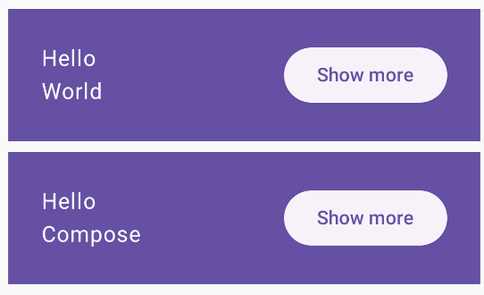
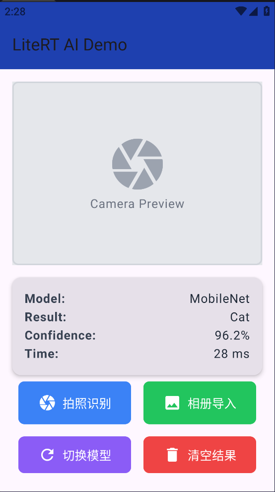

# 实验2.2：构建 Kotlin 应用并使用 Compose 布局

## 实验概述

本实验包含三个部分，旨在学习使用 Kotlin 和 Jetpack Compose 构建 Android 应用程序。

---

## 实验 1：MyFirstKotlinApp - Kotlin 基础应用

### 实验目标
- 学习 Kotlin 语言基础语法
- 掌握 Android 应用的基本结构
- 了解 Activity 和布局的基本概念

### 实验内容
创建第一个 Kotlin Android 应用，熟悉项目结构和基本组件。

### 项目结构
```
MyFirstKotlinApp/
├── app/
│   └── src/main/
│       ├── java/com/example/myfirstkotlinapp/
│       │   ├── MainActivity.kt
│       │   └── ui/theme/
│       │       ├── Color.kt
│       │       ├── Theme.kt
│       │       └── Type.kt
│       └── res/
├── build.gradle.kts
├── settings.gradle.kts
└── gradle/
```

### 核心功能
- 学习 Android 项目结构
- 掌握 Activity 生命周期
- 了解资源文件管理

---

## 实验 2：BasicsCodelab - Compose 基础布局

### 实验目标
- 学习 Jetpack Compose 的基本概念
- 掌握 Compose 布局的使用方法
- 实现交互式 UI 组件

### 实验内容
创建一个简单的 Compose 应用，包含文本显示和按钮交互功能。

### 实验结果



### 项目结构
```
BasicsCodelab/
├── app/
│   └── src/main/
│       ├── java/com/example/basicscodelab/
│       │   ├── MainActivity.kt
│       │   └── ui/theme/
│       │       ├── Color.kt
│       │       ├── Theme.kt
│       │       └── Type.kt
│       └── res/
├── build.gradle.kts
├── settings.gradle.kts
└── gradle/
```

### 核心功能
- 显示 "Hello World" 和 "Hello Compose" 文本
- "Show more" 按钮实现文本切换功能
- 使用 Material Design 主题

---

## 实验 3：AI 图像识别应用

### 实验目标
- 集成机器学习模型
- 实现相机拍照功能
- 实现图像分类识别

### 实验内容
创建一个基于 MobileNet 模型的图像识别应用，支持拍照识别和相册导入。

### 实验结果



### 项目结构
```
AI/
├── app/
│   └── src/main/
│       ├── java/com/example/ai/
│       │   ├── MainActivity.kt
│       │   └── ui/theme/
│       │       ├── Color.kt
│       │       ├── Theme.kt
│       │       └── Type.kt
│       └── res/
├── build.gradle.kts
├── settings.gradle.kts
└── gradle/
```

### 核心功能
- 📷 **拍照识别**：使用相机拍摄图片并进行识别
- 🖼️ **相册导入**：从相册选择图片进行识别
- 🔄 **切换模型**：支持切换不同的识别模型
- 🗑️ **清空结果**：清除当前识别结果
- 显示识别结果、置信度和耗时

---

## 技术栈

| 技术 | 版本 |
|------|------|
| Kotlin | 1.9+ |
| Jetpack Compose | 1.6+ |
| Android Gradle Plugin | 8.1+ |
| MobileNet | TensorFlow Lite |

---

## 运行方式

1. 使用 Android Studio 打开项目
2. 连接 Android 设备或启动模拟器
3. 点击 "Run" 按钮运行应用

---

## 实验总结

通过本实验，学习了：
- Kotlin 语言基础和 Android 应用结构
- Jetpack Compose 的声明式 UI 编程
- Compose 布局和组件的使用
- 机器学习模型的集成方法
- 相机和相册权限的处理
