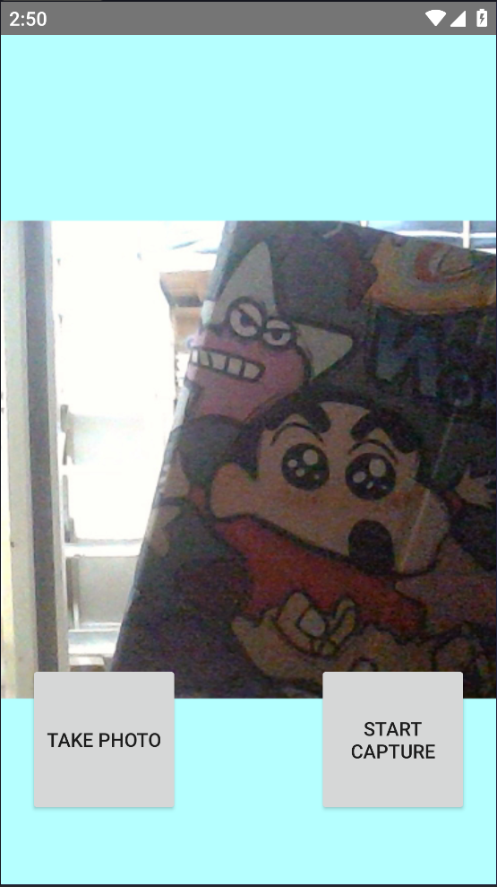
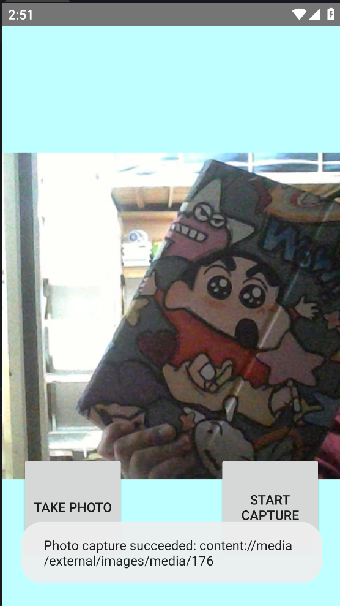

# CameraX 应用实验

本项目是一个基于 Android CameraX 库构建的相机应用，支持拍照和录像功能。

## 功能特性

- 📷 **拍照模式**：支持拍摄静态图片并保存到相册
- 🎥 **录像模式**：支持录制视频并保存到相册
- 🔄 **模式切换**：可在拍照和录像模式之间切换
- 📱 **实时预览**：相机实时预览画面

## 界面展示

### 主界面



应用主界面包含相机预览区域和两个操作按钮：
- **TAKE PHOTO**：拍照按钮
- **START CAPTURE**：开始录制按钮

### 拍照功能



点击 **TAKE PHOTO** 按钮后，应用会自动拍摄照片并保存到相册，同时显示提示信息。

### 录像功能


点击 **START CAPTURE** 按钮后，应用切换到录像模式，再次点击开始/停止录制。

## 项目结构

```
CameraXApp/
├── app/
│   └── src/main/
│       ├── java/com/android/example/cameraxapp/
│       │   └── MainActivity.kt    # 主活动，包含相机逻辑
│       ├── res/layout/
│       │   └── activity_main.xml  # 界面布局
│       └── AndroidManifest.xml    # 权限配置
├── build.gradle.kts               # 项目构建配置
└── gradle/                        # Gradle 配置
```

## 核心代码实现

### 权限申请

应用需要以下权限：
- `CAMERA`：相机权限
- `RECORD_AUDIO`：录音权限（录像时使用）
- `WRITE_EXTERNAL_STORAGE`：存储权限（Android P及以下）

### 拍照实现

```kotlin
private fun takePhoto() {
    val imageCapture = imageCapture ?: return
    val name = SimpleDateFormat(FILENAME_FORMAT, Locale.US)
        .format(System.currentTimeMillis())
    val contentValues = ContentValues().apply {
        put(MediaStore.MediaColumns.DISPLAY_NAME, name)
        put(MediaStore.MediaColumns.MIME_TYPE, "image/jpeg")
    }
    // 保存到相册
    val outputOptions = ImageCapture.OutputFileOptions
        .Builder(contentResolver, MediaStore.Images.Media.EXTERNAL_CONTENT_URI, contentValues)
        .build()
    imageCapture.takePicture(outputOptions, ...)
}
```

### 录像实现

```kotlin
private fun captureVideo() {
    val videoCapture = this.videoCapture ?: return
    val recorder = Recorder.Builder()
        .setQualitySelector(QualitySelector.from(Quality.HIGHEST, ...))
        .build()
    videoCapture = VideoCapture.withOutput(recorder)
    // 录制并保存到相册
    recording = videoCapture.output
        .prepareRecording(this, mediaStoreOutputOptions)
        .start(...)
}
```

## 使用说明

1. 打开应用后，系统会请求相机，录音权限
2. 默认进入拍照模式
3. 点击 **TAKE PHOTO** 拍摄照片
4. 点击 **START CAPTURE** 切换到录像模式，再次点击开始录制
5. 录制过程中点击按钮停止录制

## 技术栈

- **Android SDK**：API 24+
- **CameraX**：Google 官方相机库
- **Kotlin**：编程语言
- **View Binding**：视图绑定

## 实验目的

本实验旨在学习：
1. CameraX 库的基本使用方法
2. 相机权限的申请与管理
3. 图片和视频的捕获与保存
4. Android 多媒体开发基础