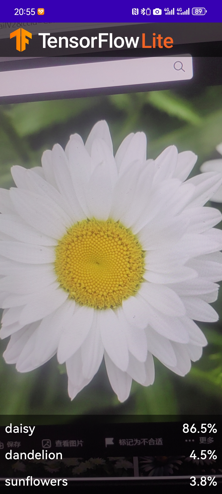
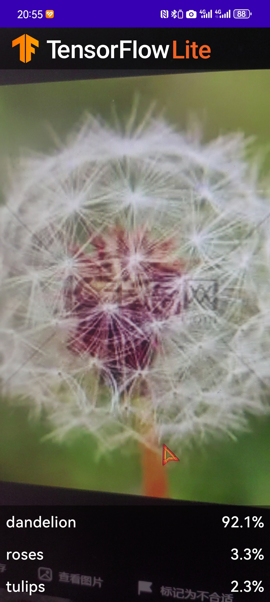
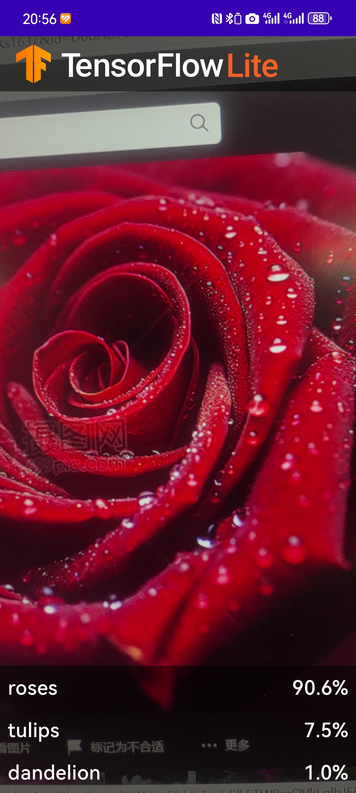
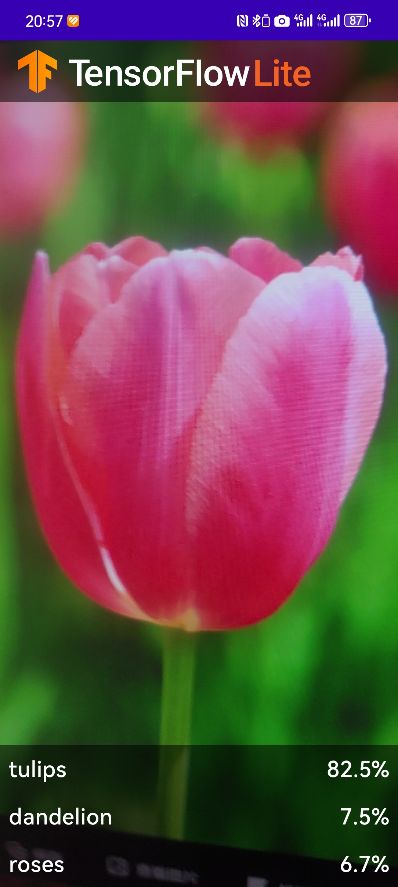

# TensorFlow Lite 花卉识别应用

基于 TensorFlow Lite Model Maker 和 Android Studio ML Model Binding 的 Android 花卉识别应用。

## 项目简介

本项目是一个 Android 应用程序，使用 TensorFlow Lite 进行实时花卉识别。通过设备摄像头实时捕获图像，并利用预训练的机器学习模型识别花卉种类。

## 功能特性

- 实时摄像头预览和图像分析
- 支持 GPU 加速推理（设备兼容时自动启用）
- 显示 Top 3 识别结果及置信度
- 支持屏幕旋转

## 支持识别的花卉

本应用可以识别以下 **5 种花卉**：

| 花名 | 英文名称 |
|------|----------|
| 雏菊 | Daisy |
| 蒲公英 | Dandelion |
| 玫瑰 | Rose |
| 向日葵 | Sunflower |
| 郁金香 | Tulip |

## 识别效果展示

### 雏菊 (Daisy)


### 蒲公英 (Dandelion)


### 玫瑰 (Rose)


### 向日葵 (Sunflower)


### 郁金香 (Tulip)


## 项目结构

```
TFLClassify/
├── start/                    # 起始代码（练习模板）
│   └── src/main/
│       ├── java/             # Kotlin 源代码
│       ├── res/              # 资源文件
│       └── AndroidManifest.xml
├── finish/                   # 完成代码（参考实现）
│   └── src/main/
│       ├── java/             # Kotlin 源代码
│       ├── ml/               # TensorFlow Lite 模型
│       │   └── FlowerModel.tflite
│       ├── res/              # 资源文件
│       └── AndroidManifest.xml
├── image/                    # 识别效果截图
├── build.gradle              # 项目级构建配置
├── settings.gradle           # 项目设置
└── gradle.properties         # Gradle 属性配置
```

## 技术栈

- **Kotlin** - 主要编程语言
- **CameraX** - 相机预览和图像分析
- **TensorFlow Lite** - 机器学习推理
- **TensorFlow Lite Support** - 模型支持库
- **ViewBinding & DataBinding** - 视图绑定
- **LiveData & ViewModel** - 架构组件

## 环境要求

- Android Studio Arctic Fox 或更高版本
- Android SDK 21+ (Android 5.0 Lollipop)
- Gradle 7.1.3
- Kotlin 1.6.21

## 依赖库

```gradle
// TensorFlow Lite
implementation 'org.tensorflow:tensorflow-lite-support:0.4.4'
implementation 'org.tensorflow:tensorflow-lite-metadata:0.4.4'

// CameraX
implementation 'androidx.camera:camera-camera2:1.0.0-beta10'
implementation 'androidx.camera:camera-lifecycle:1.0.0-beta10'
implementation 'androidx.camera:camera-view:1.0.0-alpha17'

// GPU 加速（可选）
implementation 'org.tensorflow:tensorflow-lite-gpu:2.3.0'
```

## 构建和运行

1. 克隆或下载本项目
   ```bash
   git clone <repository-url>
   ```

2. 使用 Android Studio 打开项目

3. 等待 Gradle 同步完成

4. 选择 `finish` 模块运行（完整实现版本）

5. 授予相机权限后即可开始识别


### 图像处理流程

1. 从 CameraX 获取图像帧
2. 转换为 Bitmap 格式
3. 转换为 TensorImage
4. 模型推理获取结果
5. 排序并显示 Top 3 结果


## 参考资料

- [Recognize Flowers with TensorFlow on Android](https://goo.gle/3dbCSbt)
- [TensorFlow Lite 官方文档](https://www.tensorflow.org/lite)
- [CameraX 官方文档](https://developer.android.com/training/camerax)
